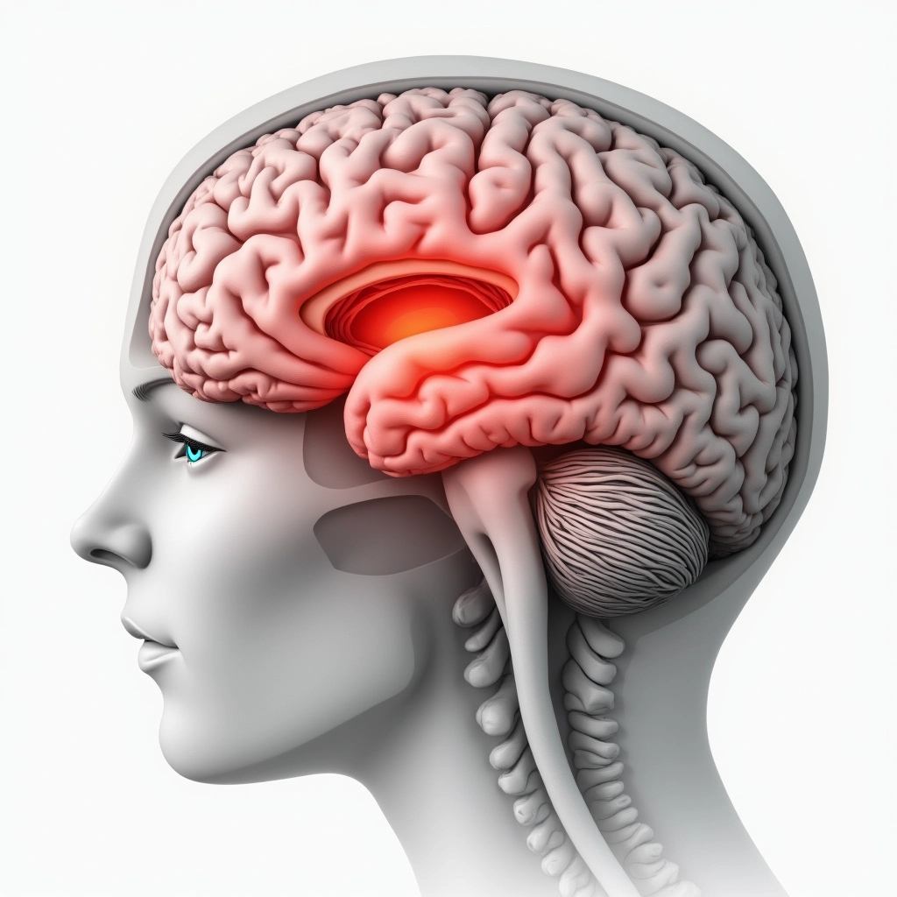
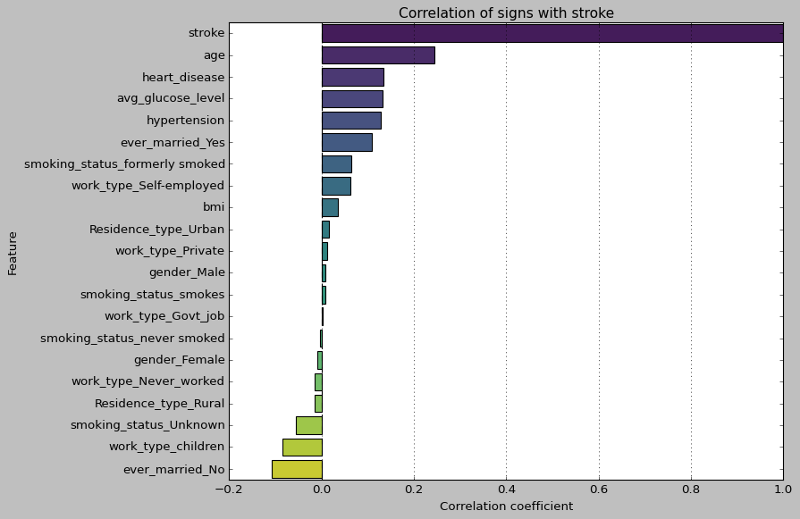
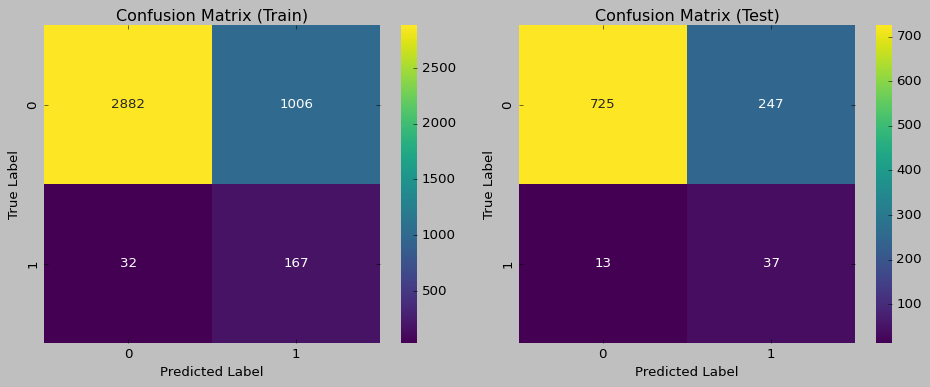
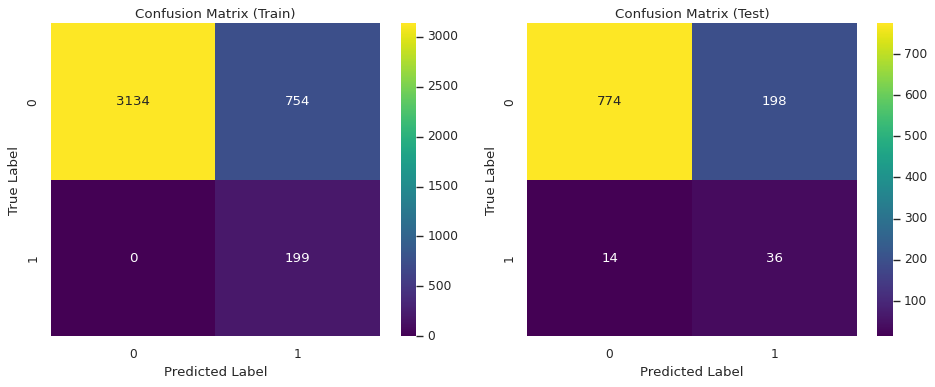
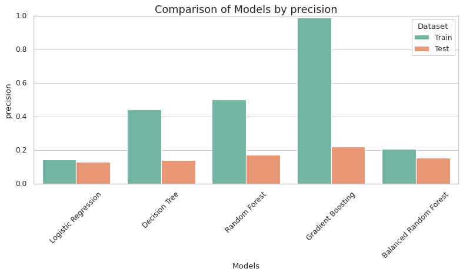
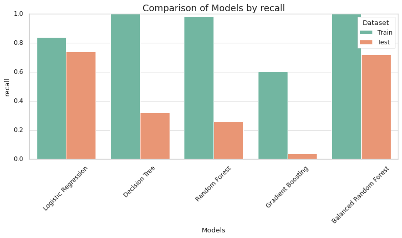
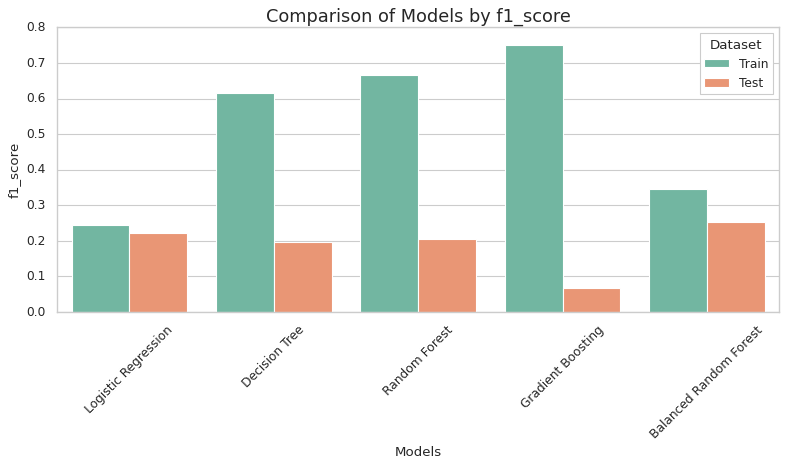
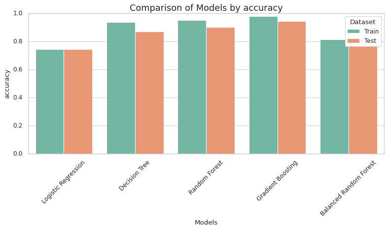

# Classification model: Stroke Prediction

# A model for predicting the risk of stroke in a patient

This project was developed to determine the likelihood of a patient having a stroke. The interactive interface is based on [**Streamlit**](https://stroke-prediction-ms.streamlit.app/), which allows you to easily interact with the model and analyze the results.



## Description

**1. Project objective:** To create an analytical tool to study the risk of stroke in a patient, taking into account various factors

**2. Project objectives:**

**Data analysis**: to identify the factors that influence to the risk of stroke in a patient.

- data analysis: to identify key factors that influence the risk of stroke;
- model Building: use machine learning and statistical analysis to create a model that can predict stroke risk;
- user Interface: develop an interactive interface that allows users to enter new data, analyze the results, and make predictions based on the model.

## Technologies

The project was implemented using the following technologies:

- **Python**: the main programming language

## Libraries

- **Pandas**: for data processing;
- **Numpy**: for numerical calculations;
- **Scikit-learn**: for building and evaluating machine learning models;
- **Imbalanced-learn**: provides tools when dealing with classification with imbalanced classes;
- **Matplotlib** and **Seaborn**: for data visualization;
- **Streamlit**: for creating an interactive interface;
- **Joblib**: for efficient serialization (saving) and loading of Python objects.

## Dataset

**The dataset used for this project has the following characteristics:**

- **https://www.kaggle.com/datasets/fedesoriano/stroke-prediction-dataset**
- format: `.csv`;
- contains the following key columns: `gender`, `age`, `hypertension`, `stroke`, etc.

This dataset contains 5110 rows with 12 different characteristics:

- **id**: unique identifier;
- **gender**: the patient's gender ("Male", "Female" or "Other");
- **age**: patient's age;
- **hypertension**: the presence of hypertension (0 - no, 1 - yes);
- **heart_disease**: presence of heart disease (0 - no, 1 - yes);
- **ever_married**: marriage status ("No" or "Yes");
- **work_type**: type of work ("children", "Govt_jov", "Never_worked", "Private" or "Self-employed");
- **Residence_type**: type of residence ("Rural" or "Urban");
- **avg_glucose_level**: average blood glucose level;
- **bmi**: body mass index;
- **smoking_status**: smoking status ("formerly smoked", "never smoked", "smokes" or "Unknown");
- **stroke**: whether a stroke has occurred (0 - no, 1 - yes).

**_Correlation analysis_**



# **_Correlation results:_**

❌ **_Positive association with stroke risk_**:

**_age_**: 0.245239 - older people have a higher risk;

**_heart_disease_**: 0.134905 - people with heart disease have a higher risk of stroke;

**_hypertension_**: 0.127891 - people with hypertension have a higher risk of stroke;

**_avg_glucose_level_**: 0.131991 - higher glucose levels are associated with a higher risk of stroke;

**_ever_married_Yes_**: 0.108299 - married people have a slightly higher risk of stroke;

**_smoking_status_formerly smoked_**: 0.064683 - former smokers have a higher risk of stroke;

**_work_type_Self-employed_**: 0.062150 - self-employed persons have a higher risk of stroke;

**_bmi_**: 0.036075 - higher body mass index is associated with higher risk of stroke;

---

❗**Positive but very weak association**:

**_Residence_type_Urban_**: 0.015415 - urban residence;

**_work_type_Private_**: 0.011927 - work in the private sector;

**_gender_Male_**: 0.009081 - male gender;

**_smoking_status_smokes_**: 0.008920 - smokers;

**_work_type_Govt_job_**: 0.002660 - work in the civil service;

---

❎ **_Negative but very weak relationship_**:

**_smoking_status_never smoked_**: -0.004163 - people who have never smoked;

**_gender_Female_**: -0.009081 - female gender;

**_work_type_Never_worked_**: -0.014885 - people who have never worked;

**_Residence_type_Rural_**: -0.015415 - rural residence;

---

✅ **_Negative_relationship_**:

**_smoking_status_Unknown_**: -0.055924 - people with unknown smoking status;

**_work_type_children_**: -0.083888 - children have a lower risk of stroke;

**_ever_married_No_**: -0.108299 - unmarried people have a lower risk of stroke.

# **_Model Comparison_**

| Model                  | Dataset | Precision | Recall   | F1_score | Accuracy |
| ---------------------- | ------- | --------- | -------- | -------- | -------- |
| Logistic Regression    | Train   | 0.142370  | 0.839196 | 0.243440 | 0.746024 |
| Decision Tree          | Train   | 0.443207  | 1.000000 | 0.614198 | 0.938830 |
| Random Forest          | Train   | 0.503856  | 0.984925 | 0.666667 | 0.952043 |
| Gradient Boosting      | Train   | 0.991736  | 0.603015 | 0.750000 | 0.980426 |
| Balanced Random Forest | Train   | 0.208814  | 1.000000 | 0.345486 | 0.815513 |
| Logistic Regression    | Test    | 0.130282  | 0.740000 | 0.221557 | 0.745597 |
| Decision Tree          | Test    | 0.141593  | 0.320000 | 0.196319 | 0.871820 |
| Random Forest          | Test    | 0.171053  | 0.260000 | 0.206349 | 0.902153 |
| Gradient Boosting      | Test    | 0.222222  | 0.040000 | 0.067797 | 0.946184 |
| Balanced Random Forest | Test    | 0.153846  | 0.720000 | 0.253521 | 0.792564 |

**Confusion matrix LogisticRegression**


**Confusion matrix BalancedRandomForestClassifier**







# 💓**Summing up**

**_LogisticRegression_** and **_BalancedRandomForestClassifier_** show the highest sensitivity on the test dataset. However, considering also other metrics such as precision and F1-measure, the BalancedRandomForestClassifier may be a more suitable choice for this task.

If the **_primary goal_** is not to miss patients, i.e. minimize false negatives, then the key metric is **_Recall_**, namely the sensitivity for class 1.

Recall determines the proportion of correctly identified patients among all valid patients, which is critical if we are more concerned about a situation where a sick patient is classified as healthy.

The main metric is Recall for a positive class, i.e. minimizing false negatives, and from the presented results, LogisticRegression demonstrates the highest recall for class 1 - 0.74 on the test data, BalancedRandomForestClassifier - 0.72.

This means that 74% and 72% of sick patients, respectively, were correctly identified, which is critical if a diagnostic error can lead to a patient being classified as healthy.

However, it is important to remember that a high level of memorization can be accompanied by low accuracy - a large number of false positives. In my case, the accuracy for class 1 remains low for LogisticRegression - 0.13 and for BalancedRandomForestClassifier - 0.15.

✅ **_Therefore, if the main goal is not to miss sick patients, then LogisticRegression is the most appropriate model._**

## Run locally

**Clone the repository:**

```
git clone https://github.com/MariiaSam/Stroke-Prediction.git
cd Stroke-Prediction
```

**Set up the virtual environment with Poetry**

Set up project dependencies:

```
poetry install
```

To activate the virtual environment, run the command:

```
poetry shell
```

To add a dependency to a project, run the command:

```
poetry add <package_name>
```

To pull in existing dependencies:

```
poetry install
```

# Using

Run the Streamlit application with the command:

```
streamlit run app.py
```
