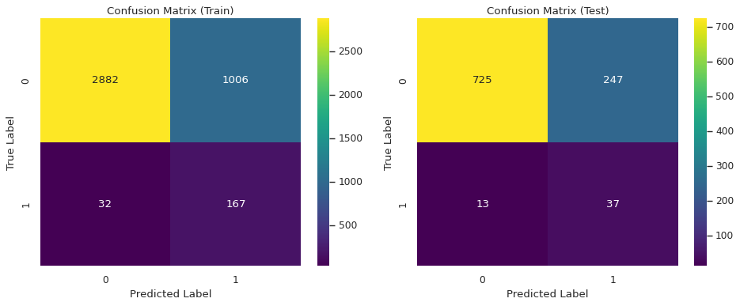

# Classification model: Stroke Prediction

#  A model for predicting the risk of stroke in a patient 
'''
This project was developed to determine the cost of rent in Brazil. The interactive interface is based on [**Streamlit**](https://rent-brazil1.streamlit.app/), which allows you to easily interact with the model and analyze the results.


## Description

**1. Project objective:** To create an analytical tool for researching the value of rents in Brazil, including various factors, including regions.

**2. Project tasks:**.

- **Data analysis**: to identify the key factors that influence the cost;
- **Model building**: using machine learning and statistical analyses to create a model that can predict rental values;
- **User interface**: develop an interactive interface that will allow users to enter new data, analyze the results and make predictions based on the model.

## Technologies

The project was implemented using the following technologies:

- **Python**: the main programming language;
- **Docker Compose**: to simplify the process of deploying and managing the project in the Docker environment.

## Libraries

- **Pandas**: for data processing;
- **Numpy**: for numerical calculations;
- **Scikit-learn**: for building and evaluating machine learning models;
- **Matplotlib** and **Seaborn**: for data visualization;
- **Streamlit**: for creating an interactive interface;
- **Joblib**: for efficient serialization (saving) and loading of Python objects.

## Dataset

**The dataset used for this project has the following characteristics:**

- **https://www.kaggle.com/datasets/iamsouravbanerjee/house-rent-prediction-dataset**
- format: `.csv`;
- contains the following key columns: `city`, `rent amount`, `bill_avg`, `parking spaces`, etc.

This dataset contains 10692 rental properties with 13 different characteristics:

- **city**: the city in which the property is located;
- **area**: area of the property;
- **rooms**: number of rooms;
- **bathroom**: number of bathrooms;
- **parking spaces**: number of parking spaces;
- **floor**: floor;
- **animals**: permission to stay with animals;
- **furniture**: furniture;
- **hoa (R$)** : homeowners association tax;
- **rent amount (R$)**: the amount of rent;
- **property tax**: Municipal property tax;
- **fire insurance (R$)**: the cost of fire insurance;
- **total (R$)**: the total sum of all values.

## The cost of renting an apartment depending on the number of rooms


## Rental housing costs depending on the city


✅ **_In São Paulo, the average cost of rent is higher than in other cities._**
**_And this is not surprising, as it is the center of a large agglomeration with a population of 23 million, also one of the largest in the world._**

## Correlation analysis conclusions for rent amount:



**_Correlation analysis conclusions for rent amount:_**

**_Strong positive relationship_**: variables that are highly positively correlated with rent amount have a direct relationship. That is, when the value of these variables increases, the rent also increases;

- **fire insurance (0.987)**: very strong correlation with rent amount. This is expected as the amount of insurance can be proportional to the rent;

- **bathrooms (0.666)**: having more bathrooms is associated with higher rents. This indicates that living spaces with more amenities are more expensive;

- **parking spaces (0.574)**: housing with parking spaces has higher rents, as it is often a sign of luxury or convenience;

- **rooms (0.537)**: a larger number of rooms is also associated with higher rents, which is consistent with the logic of larger areas;

- **City São Paulo (0.25)**: location strongly influences higher rents.

**_Weak positive relationship_**:

- **area (0.178)**: area has a moderate positive correlation, but is not a key factor. This may indicate that a larger area does not always mean significantly higher rents;

- **property tax (0.107)**: property tax has a weak impact. It is probably taken into account by property owners, but is not a direct indicator of rents.

**_Almost neutral impact:_**

- **floor (0.071)**: floor has a very weak impact on rents, which may depend on the city and the architecture of the buildings;

- **animal accept (0.06)**: minor impacts on rent levels;

- **hoa (0.052)**: small relationship with homeowners' association fees. This may only affect certain types of housing (e.g., apartments in condominiums);

**_Negative correlation_**: variables with a negative correlation have an inverse relationship, i.e., when the value of the variable increases, the rent decreases.

- **animal_not_accept (-0.06)**: in premises where animals are not allowed, rents are slightly lower;

- **furniture_not furnished (-0.17)**: show an inverse relationship, possibly due to tenant preferences.

Cities, for example, city_Belo Horizonte, city_Campinas: In cities with a negative correlation with rent amount, rents may be lower compared to the base cities (e.g. city_São Paulo).

## Models:

- the following models were tested in the project: **LinearRegression; Linear regression with Lasso, Ridge, ElasticNet regularization; SVR, RandomForestRegressor**;

- was used to select the best hyperparameters: GridSearchCV.

# Compare results:

| Model                                                         | MAE        | MSE          | RMSE        | R2       |
| ------------------------------------------------------------- | ---------- | ------------ | ----------- | -------- |
| **Linear Regression (Train)**                                 | 296.182627 | 2.156508e+05 | 464.382169  | 0.981444 |
| **Linear Regression (Test)**                                  | 321.153450 | 6.703823e+05 | 818.768761  | 0.946516 |
| **Linear regression with Lasso regularization (Train)**       | 293.663125 | 2.247485e+05 | 474.076464  | 0.980661 |
| **Linear regression with Lasso regularization (Test)**        | 315.717036 | 3.939180e+05 | 627.628853  | 0.968573 |
| **SVR (Train)**                                               | 284.258514 | 1.639049e+06 | 1280.253446 | 0.858968 |
| **SVR (Test)**                                                | 291.741362 | 4.293574e+05 | 655.253668  | 0.965745 |
| **Random Forest Regressor (Train)**                           | 123.370415 | 5.525399e+04 | 235.061670  | 0.995246 |
| **Random Forest Regressor (Test)**                            | 342.022606 | 9.401107e+05 | 969.593048  | 0.924996 |
| **Linear regression with Ridge regularization (Train)**       | 296.434150 | 2.156853e+05 | 464.419328  | 0.981441 |
| **Linear regression with Ridge regularization (Test)**        | 321.891060 | 6.876466e+05 | 829.244573  | 0.945138 |
| **Linear regression with Elastic Net regularization (Train)** | 294.810219 | 2.231826e+05 | 472.422034  | 0.980796 |
| **Linear regression with Elastic Net regularization (Test)**  | 294.810219 | 2.231826e+05 | 472.422034  | 0.980796 |

# **_Comparisons and conclusions_**

Model evaluation is based on several metrics: MAE (Mean Absolute Error), MSE (Mean Squared Error), RMSE (Root Mean Squared Error), and R² (coefficient of determination). The best model can be chosen depending on the purpose of the analysis, but in general, lower errors (MAE, MSE, RMSE) and higher R² indicate a better model.

❎ **_Best model:_**

**Best model: Elastic Net (a regularized linear regression)**. Why:

High R² on training (0.9808) and test (0.9808) data.
The lowest RMSE on the test data (472.42), indicating the best fit to real-world values.

Elastic Net balances the regularization, avoiding overfitting.

**Alternative model: Lasso Regression (a regularized linear regression)**. Why:
The second best R² on the test data (0.9686).
Low RMSE (627.63), which also indicates good consistency.
Less sensitive to collinearity than simple linear regression.

⭕ **_Worst Model:_**

Random Forest overfits the training data, with the highest test errors and reduced generalizability. It may require hyperparameter tuning to improve its performance.

## Run locally

**Clone the repository:**

```
git clone https://github.com/MariiaSam/Rent-in-Brazil.git
cd Rent-in-Brazil
```

**Set up the virtual environment with Poetry**

Set up project dependencies:

```
poetry install
```

To activate the virtual environment, run the command:

```
poetry shell
```

To add a dependency to a project, run the command:

```
poetry add <package_name>
```

To pull in existing dependencies:

```
poetry install
```

# Using

Run the Streamlit application with the command:

```
streamlit run app.py
```

# Docker

This project also supports Docker containerization, which makes it easy to run the application without having to manually configure the environment.

**1. Starting a project via Docker**

Use the command to run a container based on your Docker Image:

```
docker run --rm -d -p 8880:8880 rentinbrazil:latest
```

--rm - automatically removes the container after stopping;

-d - runs the container in the background;

-p 8880:8880 - displays port 8880 on the local machine to access the application.

**2. Access to the application:**

After starting the container, the application will be available at the address:

```
http://localhost:8880
```

3. **Stopping the project:**

To stop the project, do:

```
docker ps
```

Then use the command to stop the container:

```
docker stop <container_id>
```

Where <container_id> is your container's identifier, obtained from the docker ps command.
'''
